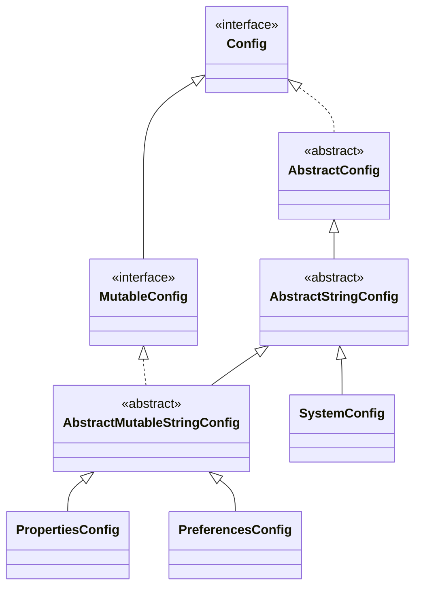

# Orne Configuration utilities

Provides utilities for application configuration management.

## Usage

The library can be obtained from [Maven Central][maven central] with the
following coordinates:

```xml
<dependency>
  <groupId>dev.orne</groupId>
  <artifactId>config</artifactId>
  <version>0.2.0</version>
</dependency>
```

## Configurations

Interface `Config` is the central interface, used to access configuration
values abstracting the mechanism used to store such information. Provides
methods to retrieve `String`, `Boolean` and `Number` values "out of the box",
plus a generic method to retrieve any value type. It's base implementation
(`AbstractConfig`) uses [Apache Commons BeanUtils][apache beanutils] for
value conversion, that by default includes the additional converters provided
by [Orne Beans][orne beans].

Interface `MutableConfig` provides additional methods to modify the
configuration values, such as user preferences.

### Provided implementations

#### SystemConfig

#### PropertiesConfig

#### PreferencesConfig

### Hierarchical configurations

## Secure configuration storage


## Integration with [Apache Commons Configuration][apache configuration]

### Java Preferences based Apache Commons Configuration


## Extension



[maven central]: https://search.maven.org/
[apache beanutils]: http://commons.apache.org/proper/commons-beanutils/
[apache configuration]: http://commons.apache.org/proper/commons-configuration/
[orne beans]: https://github.com/orne-dev/java-beans/
